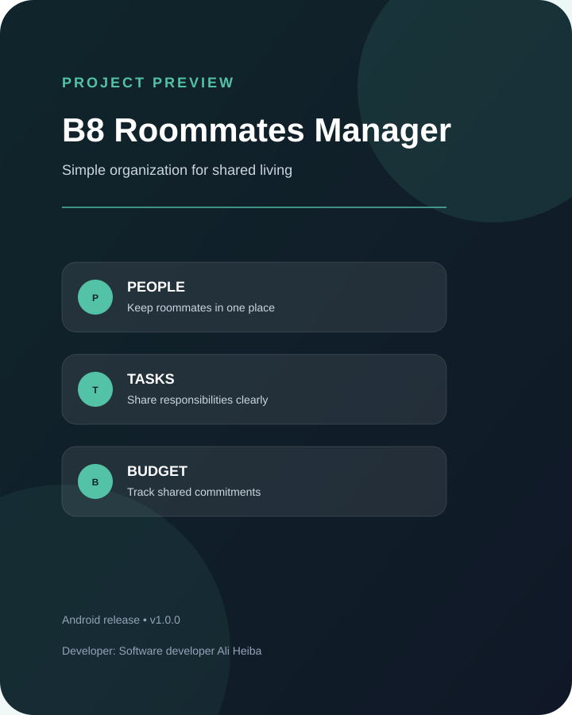
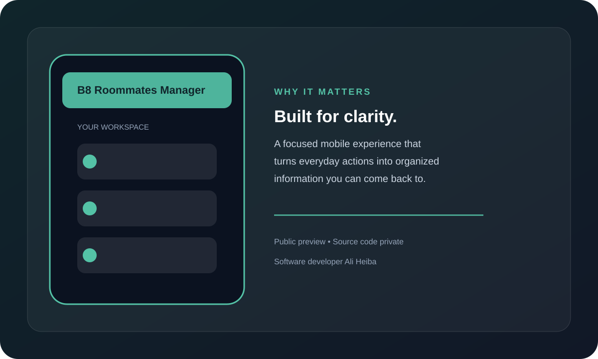

# B8 Roommates Manager

**مدير عملي لتنظيم الحياة اليومية في السكن المشترك.**

## فكرة المشروع

يستهدف **B8 Roommates Manager** الأشخاص الذين يعيشون مع زملاء أو أفراد آخرين في منزل واحد، ويساعدهم على جعل تفاصيل السكن المشترك أكثر وضوحًا وتنظيمًا. الفكرة الأساسية هي تقليل الفوضى الناتجة عن المصروفات والمهام والاتفاقات اليومية، وتحويلها إلى إدارة أبسط يمكن للجميع متابعتها.

## الاستخدام المقصود

يمكن استخدام المشروع كنقطة مركزية لإدارة جوانب مثل:

- تنظيم بيانات السكن والمقيمين.
- متابعة المسؤوليات والمهام المشتركة.
- توضيح الالتزامات والمصروفات بين أفراد المنزل.
- تقليل سوء الفهم من خلال عرض المعلومات بصورة منظمة.
- دعم تجربة سكن أكثر تعاونًا ووضوحًا.

## لمن صُمم؟

- الشركاء في السكن.
- الطلاب المقيمون في شقق مشتركة.
- العائلات أو المجموعات التي تتقاسم مهام منزلية.
- أي فريق صغير يحتاج إلى طريقة بسيطة لمتابعة شؤون المكان.

## الإصدار المتاح

هذا المستودع العام مخصص لعرض فكرة المشروع وتوفير نسخة Android الجاهزة. **الكود المصدري محفوظ في مستودع خاص وغير منشور للعامة.**

- الإصدار: `1.0.0`
- المنصة: Android
- [تحميل APK](../../B8RoommatesManager-Public/releases/tag/v1.0.0)

## Screenshots

### Project overview

### Experience preview

> هذه الصور معاينات مرئية تعريفية للنسخة العامة، بينما يظل الكود المصدري محفوظًا في مستودع خاص.

## المطور

**Software developer Ali Heiba**

## ملاحظة

ينبغي استخدام التطبيق بموافقة جميع المقيمين، وتجنب إدخال بيانات شخصية أو مالية حساسة إلا عند الحاجة ومع اتخاذ الاحتياطات المناسبة.
